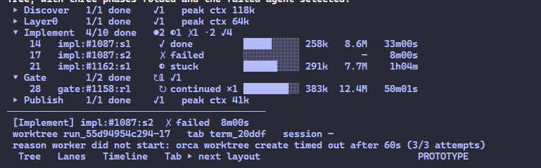

# Orca run view: the tree

The reference design for the Orca runner's [run view](../../CONTEXT.md) (spec #43, ADR-0012). It came from a throwaway prototype on branch `prototype/orca-run-view`, which you can run with `npm start` in `skills/engineering/implement-spec-in-workflow/orca/prototype-run-view/` for the live behaviour.



## Check your work against this

- **Layout:**
  - A header: the run's name, project, Run id, spec, whether the runner is alive, and elapsed time. Under it, the number of agents in each state.
  - One row per phase. When the phase is unfolded, one row per agent sits under it.
  - A bottom pane that describes the selected row.
  - A key-help line.
- **Phase row:**
  - `▾` when unfolded, `▸` when folded.
  - The phase name, `done/total done`, and the mix of states as glyph and count (`●2 ◐1 ✗1 ·2 ✓4`).
  - When folded, also `peak ctx` for the phase.
  - Clicking the row, pressing Enter, or using ←/→ folds and unfolds it.
- **Agent row:**
  - The agent's number, its label, and its state as a glyph and a word (`✓ done`, `✗ failed`, `◐ stuck`, `● running`, `↻ continued ×N`, `· queued`).
  - A context bar with the context size.
  - Cumulative tokens, and elapsed time.
  - An agent that never started shows `—` for context and tokens.
- **Bottom pane for a selected agent:**
  - `[Phase] label`, then its state, context, total tokens and elapsed time.
  - `worktree`, `tab` and `session` (`—` when there is none).
  - `reason` when the agent failed or is stuck.
  - The transcript path.
- **Bottom pane for a selected phase:** its failed and blocked agents, each with its reason.

## What the image does not decide

- **Ignore the bottom status bar** (`Tree  Lanes  Timeline  Tab ▸ next layout … PROTOTYPE`). It belonged to the prototype's layout toggle, which was dropped. The run view has one layout.
- **Colours:**
  - The screenshot's terminal theme flattens them.
  - Context size and its bar are coloured by band: green below 200k, yellow from 200k to 350k, red above 350k.
  - States have their own colours. Cumulative tokens are grey. The selected row is shown inverted.
- **Exact spacing and column widths** are a guide, not a contract.
- **The key-help line** lists the view's own keys (#51): `l` opens the log in a tab of its own that follows it; `R` resume, `e` end-of-run and `s` all runs were the prototype's.

## Last design check

2026-09-25, #51: `run-view/view.mjs` against a fixture run shaped like the capture below, in an Orca 1.4.209 tab 120 columns wide on Windows 11, read back with `orca terminal read --screen`. Item by item against the checklist above:

- **Folded phase** (Discover, Layer0, Publish): `▸`, `1/1 done`, `✓1`, `peak ctx`. Matches.
- **Unfolded phase** (Implement, Gate, Integrate): `▾`, `4/10 done`, `●2 ◐1 ✗1 ·2 ✓4`, one row per agent with number, label, glyph and word (`↻ continued ×1`), bar and size, tokens and elapsed; `—` for an agent that never started. Matches.
- **Selected phase**: its failed and stuck agents with their reasons, and the fold hint. Matches.
- **Selected agent** (the failed `impl:#1087:s2`, as in the image): `[Implement] impl:#1087:s2  ✗ failed  ctx —  total —  8m00s`, then worktree, tab and session (`—`), the reason and the transcript. Matches. A worktree is named, not given as a path, and a tab by its handle's first characters, so that line fits 120 columns.
- **Clicks**: SGR mouse presses, sent into the tab with `orca terminal send`, on the Discover row (it unfolded) and on a running agent's row (`orca terminal switch` brought its tab forward). Then real pointer clicks, made with `orca computer click` on the Orca window, against a second fixture run (Discover with one done agent, folded; Implement with a running agent whose tab was a real Orca tab, and a queued one), the view in its own tab 157 columns wide. A click on the folded Discover row unfolded it and selected it (`▾`, its agent listed, `← / Enter / click to fold`). A click on the running agent's row selected it (its pane showed `tab term_fde14ad6 (open)`) and brought that agent's tab to the front in Orca, seen on a screenshot. Both worked first time; the view was not changed.
- **`l`** (2026-09-25, #51): a third fixture run whose run dir, as `<notes-dir>/orca-run`, was outside every checkout, the view in its own Orca 1.4.209 tab, `l` sent with `orca terminal send`. `orca file open` refuses such a file (`invalid_relative_path`), so `l` now opens a tab titled `runner.log`, in PowerShell, that shows the log's last 200 lines and follows it (`Get-Content -Encoding UTF8 -Tail 200 -Wait`). It appeared in `orca terminal list`, and `orca terminal read` showed every line of runner.log with `✓` and `·` intact, then a line appended afterwards. The flash line read `opened … in a tab that follows it`. A second `l` opened no new tab: it switched to that one (`switched to the tab following …`). The first try showed `✓` garbled, because Windows PowerShell read the UTF-8 log as ANSI; `-Encoding UTF8` fixed it. The layout was not changed.

## Plain-text capture

The same screen with colour removed, from the prototype at 140 columns. The status bar is left out.

```
 implement-spec-783 · controlayer · run_55d94954c294 · spec #783 W5.2 · runner ● alive · 1h35m
 ● 2 running  ↻ 1 continued  ◐ 1 stuck  · 3 queued  ✓ 8 done  ✗ 1 failed
────────────────────────────────────────────────────────────────────────────────────────────────
   #   AGENT                    STATE            CONTEXT           TOKENS   ELAPSED
 ▸ Discover   1/1 done    ✓1   peak ctx 118k
 ▸ Layer0     1/1 done    ✓1   peak ctx 64k
 ▾ Implement  4/10 done   ●2 ◐1 ✗1 ·2 ✓4
    3   impl:#1159:s1          ✓ done           ████░░░░░░ 181k     5.2M    28m00s
    6   impl:#1160:s1          ✓ done           ██████░░░░ 311k     9.1M    42m00s
    7   impl:#1160:s2          ● running        ███░░░░░░░ 153k     2.3M    38m01s
   14   impl:#1087:s1          ✓ done           █████░░░░░ 258k     8.6M    33m00s
   17   impl:#1087:s2          ✗ failed         ░░░░░░░░░░             —     8m00s
   18   impl:#1158:s1          ✓ done           ████░░░░░░ 204k     6.0M    30m00s
   21   impl:#1162:s1          ◐ stuck          ██████░░░░ 291k     7.7M     1h04m
   22   impl:#1163:s1          ● running        █░░░░░░░░░  63k     940k    12m01s
   30   impl:#1154:s1          · queued         ░░░░░░░░░░             —         —
   31   impl:#1156:s1          · queued         ░░░░░░░░░░             —         —
 ▾ Gate       1/2 done    ↻1 ✓1
    4   gate:#1159:r1          ✓ done           ██░░░░░░░░  92k     1.4M     8m00s
   28   gate:#1158:r1          ↻ continued ×1   ████████░░ 383k    12.4M    50m01s
 ▸ Publish    1/1 done    ✓1   peak ctx 41k
 ▾ Integrate  0/1 done    ·1
   40   integration            · queued         ░░░░░░░░░░             —         —
────────────────────────────────────────────────────────────────────────────────────────────────
 [Implement] impl:#1087:s2  ✗ failed  ctx —  total —  8m00s
 worktree run_55d94954c294-17   tab term_20ddf   session —
 reason worker did not start: orca worktree create timed out after 60s (3/3 attempts)
 transcript ~/.claude/projects/…-run-55d94954c294-17/(none).jsonl

 ↑↓ move · ←→ / click a phase to fold · ⏎/click focus tab · r reclaim · R resume · e end-of-run · s all runs · q quit
```
